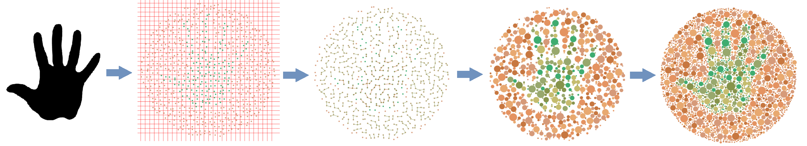
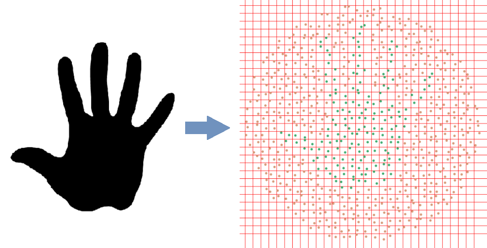
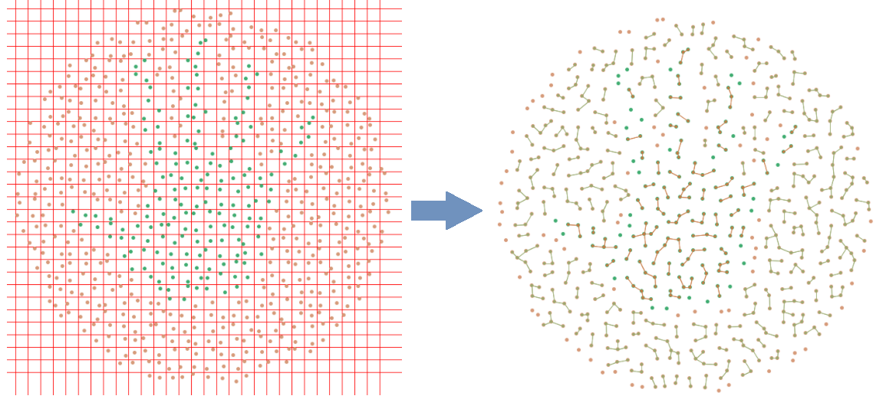
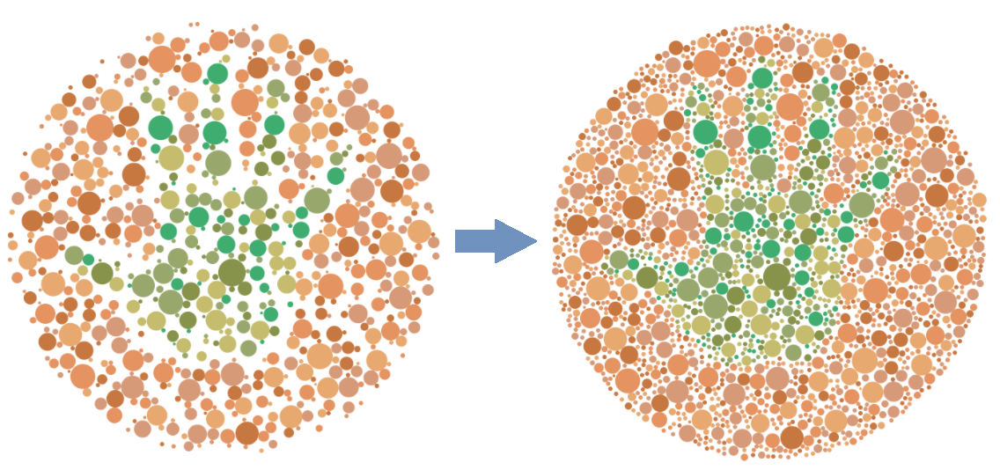
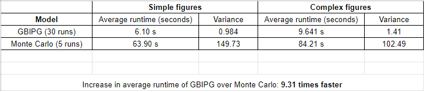
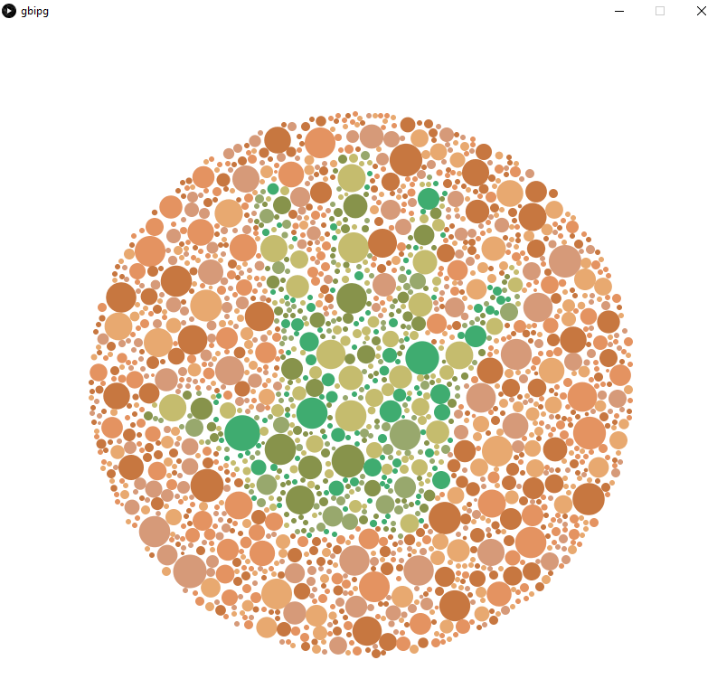

# gbipg
Graph-based [Ishihara Plate](https://en.wikipedia.org/wiki/Ishihara_test) Generation Algorithm. Implemented in [Processing Python Mode](https://py.processing.org/).

Machine Project Submission for CS 180. <br><br>
Group 14 - Jendertuicy:
* De Castro, Hans
* Dycaico, Julian
* Marinas, Kenneth
* Nakano, Ryosuke

## Table of Contents
* [The GBIPG Algorithm](#the-gbipg-algorithm)
    * [Summary](#summary)
    * [Data Collection and Preprocessing](#data-collection-and-preprocessing)
    * [Description of the Algorithm](#description-of-the-algorithm)
* [Benchmark Results](#benchmark-results) 
* [Getting Started With The Program](#getting-started-with-the-program)
    * [Prerequisites](#prerequisites)
    * [Installation](#installation)
* [Usage](#usage)
    * [Quick Start](#quick-start)
    * [GBIPG and Monte Carlo](#gbipg-and-monte-carlo)
    * [Changing the Model Parameters](#changing-the-model-parameters)
    * [Adding Your Own Input Image](#adding-your-own-input-image)

## The GBIPG Algorithm
([Go back to top](#table-of-contents))
### Summary


The _GBIPG_ algorithm is a novel way of generating _Ishihara Plates_. Normally, this process is done through the use of the [Monte Carlo](https://ianfaust.com/2016/02/19/Ishihara/) (MC) algorithm (see this [helpful resource by Ian Faust on how its done](https://ianfaust.com/2016/02/19/Ishihara/)), where the canvas is repeatedly placed with random circles until eventually it is compactly filled with it (and of course this process is done with the constraint that the circles should not overlap). But this is very inefficient, so we considered a different approach that does not rely on randomization too much. _GBIPG_ works by constructing a graph, where the nodes are the randomly-generated center points of the circles and the edges attached to the nodes represent possible overlapping with the other nearby nodes. We then solve its [Constraint Satisfaction Problem](https://en.wikipedia.org/wiki/Constraint_satisfaction_problem), where the goal state is when the radius of each circles are maximized while, at the same time, satisfying the cosntraint that the circles do not overlap with each other. Afterwards, we get a canvas compactly filled with non-overlapping circles. To finish it off, we add a bit of the traditional _Monte Carlo_ algorithm just to fill up the unfilled crevices with smaller circles. On average, [the GBIPG algorithm is 9.31 times faster than the Monte Carlo algorithm](#benchmark-results).

### Data Collection and Preprocessing
The input image to our program _must_ be in _PNG_ format and, to achieve a better result, it is _suggested_ that image is converted in its grayscale form. It could have any dimension since the user can adjust the output image dimension themselves through the [model parameters](#changing-the-model-parameters). If the `preprocess` parameter is set to `true`, the program will preprocess the given input image by:

1. Resizing the image to the given `width` and `height` parameter.
2. Converting the image to black-and-white.

The program needs the input image to be pure black-and-white to differentiate between the figure and the background since they have different color schemes. Example of input images can be found in the [data directory of the repository](https://github.com/marshblocker/gbipg/tree/main/data).

### Description of the Algorithm
The _GBIPG_ algorithm can be divided into four steps:

1. Generate random center points.
2. Construct the _Circles Adjacency Graph_ (CAG).
3. Solve the _Constraint Satisfaction Problem_ (CSP) of the CAG.
4. Final touch using the traditional _Monte Carlo_ (MC) algorithm.

Before we proceed with the different steps of the algorithm, we want to lay out some important concepts and terms that will be referenced in the description of the algorithm. First, each circle has a _minimum radius_ and a _maximum radius_ (called `min_circle_radius` and `max_circle_radius` in the model parameters), which means all of the circles generated by the algorithm cannot have their radius smaller than `min_circle_radius` (besides the circles generated by MC at the final step) and greater than the `max_circle_radius`.

#### First Step: Generate random center points.
In this step, we randomly generate the center points of the circles in such a way that their circles would not overlap with each other, with the edge of the figure, and with the edge of the canvas. This is done by making sure that even if all of the circles have their radius set to `min_circle_radius`, they would still not violate the mentioned restrictions. In our implementation, the random aspect is not "totally" random, but instead we divide the canvas into boxes, where each box a single center point can be randomly generated, with the same restrictions earlier but modified such that we don't need to check if they would overlap with the other center points since each of them have their own boxes, and also we need to make sure that each circle will not overlap with the edge of their box. The image below shows the transition from the input image to the output of the first step:



#### Second Step: Construct the _Circles Adjacency Graph_ (CAG).
In this step, we connect the center points in the canvas to form the _Circles Adjacency Graph_. We say that two nodes (center points) are connected by an edge (adjacent with each other) if at least one of them has their max radius _bounded_ by the other circle. This means that, if node A is adjacent to node B, then either the max radius of the circle at node A could not be greater than A's distance from B (otherwise they would overlap) or vice-versa. This step is implemented by finding the nearest node/s for each node and attaching an edge between them and updating the `max_radius` attribute of the node based on the nodes it is adjacent to. Note that we still need to consider the edge of the canvas and the figure, so if a node's distance to the nearest canvas wall or to the nearest figure edge is shorter than its distance to the nearest node/s, then it cannot form an edge connection with the other node/s by itself (but the other node/s can form a connection to it if they themselves were not obstructed by the canvas wall or the edge of the figure). Afterwards, we get an array of nodes where each node has their own array that keeps track of the nodes that they are adjacent with. To further speed up the algorithm, we used two heuristics to determine which nodes will be evaluated first in the third step of the algorithm. First, we re-arranged the nodes on the array such that the node with largest `max_radius` is evaluated first, then in case of a tie, the node with the most adjacent nodes is picked first. The image below shows the transition from the output of the first step to the output of the second step:



#### Third Step: Solve the _Constraint Satisfaction Problem_ (CSP) of the CAG.
In this step, we solve for the _Constraint Satisfaction Problem_ of the constructed _Circles Adjacency Graph_. The constraint of the CSP is for the circles not to overlap with each other, and the goal state is for the radius of each circle to be at their most maximum value as much as possible where their radii are bounded by the `max_circle_radius` parameter. This step is implemented by doing the following _for each node in the CAG_:

1. Set its `radius` to the _minimum_ between its `max_radius` and the distance to the nearest already-drawn circle within the area covered by the circle with `radius = min_circle_radius`.
2. Draw its circle.
3. (Look-ahead step) For each of its adjacent nodes, decrease their `max_radius` until it will not overlap with the new `radius` of the current node.

Afterwards, the goal state is reached. The image below shows the transition from the output of the second step to the output of the third step:


#### Fourth Step: Final touch using the traditional _Monte Carlo_ (MC) algorithm.
In this step, we fill the crevices of the canvas with smaller circles using the _Monte Carlo_ algorithm until we reach the `max_filled_area_ratio` parameter. The image below shows the transition from the output of the third step to the output of the fourth step:



## Benchmark Results
([Go back to top](#table-of-contents))

Initially, we want to compare our program with the [Monte Carlo implementation by Ian Faust](https://github.com/icfaust/IshiharaMC), but we have only lately realized that his program does not accept image as an input, but instead, requires the user to plot his/her figure before sending the equations to his program. This makes it difficult to give a complex input (such as a hand figure) to his program, so we decided to create our own implementation of the _Monte Carlo_ algorithm to generate Ishihara Plates that can also accept image as input. We benchmarked the _GBIPG_ algorithm and the _Monte Carlo_ algorithm and compared their results:



View [this spreadsheet](https://docs.google.com/spreadsheets/d/1A1VS5mkUtzqHA3Krc85u9qbMVFJ5Yrub/edit?usp=sharing&ouid=107804559877014682539&rtpof=true&sd=true) to see the full details of the experiment. 


## Getting Started With The Program
([Go back to top](#table-of-contents))

### Prerequisites
To run this program from the command line, you need to have Java 8 and the standalone version of Processing.py installed in your machine. 
To do so, follow the instruction in the _Requirements_ section of this [tutorial by Processing.py](https://py.processing.org/tutorials/command-line/).
Take note of the location of `processing-py.jar` file, this will be the driver of our program.

### Installation
Clone this repo in your machine using `git clone https://github.com/marshblocker/gbipg.git`.

## Usage
([Go back to top](#table-of-contents))

### Quick Start
To get a quick insight on what the program does, run the following commands in your terminal:
```
cd path/to/gbipg/directory
java -jar path/to/processing-py.jar gbipg.py
```
After a few seconds, the following Ishihara plate should display on a new window: 

### GBIPG and Monte Carlo
Within the `gbipg/` directory, there is `gbipg.py` which executes the _GBIPG_ algorithm (the program we run in the Quick Start section) and `montecarlo.py` which executes the traditional _Monte Carlo_ algorithm. If you want to use the _Monte Carlo_ algorithm, just run `java -jar path/to/processing-py.jar montecarlo.py` in your terminal. Just note that the _Monte Carlo_ algorithm is comparably slower than the _GBIPG_ algorithm.

### Changing the Model Parameters
Within the `gbipg/data/` directory, there is `config.json` which stores the parameters of both `gbipg.py` and `montecarlo.py` as separate attributes. You can change it depending on your need. Here is a table that describes what each of the parameters do:

Parameter | Description | Data Type | Example Value
:---: | :---: | :---: | :---:
`run.mode` | Use the program normally or use it to benchmark the algorithm. | `str` | `"normal"`, `"benchmark"`
`run.benchmark_iterations` | If `benchmark` mode, this parameter determines how many times the program will be run. | `int` | `2`, `10`
`run.save_states` | Save the output of each step of the _GBIPG_ algorithm as image file. | `bool` | `true`, `false` 
`image.file_name` | The name of the PNG file used as input to the program. The file should be located in `gbipg/data` directory. | `str` | `"hand.png"`, `"circle.png"`
`image.preprocess` | Preprocess the input image before it is used as input to the program. It is recommended that this is _always_ set to `true`. | `bool` | `true`, `false`
`plate.width` & `plate.height` | The width and height of the canvas. Their values should _always_ be equal. | `int` | `800`, `350`
`plate.wall_radius` | The radius of the circular wall that sets the boundary of the background display. | `int` | `232`, `100`
`plate.max_filled_area_ratio` | If the ratio of the remaining area over the total area of the canvas is above this parameter, then the algorithm stops its execution. Its values is between `0.0` and `1.0`. | `float` | `0.4`, `0.56`
`plate.circles.min_radius` | The smallest possible radius of a circle in the canvas. | `int` | `5`, `11`
`plate.circles.max_radius` | The largest possible radius of a circle in the canvas. | `int` | `15`, `8`
`plate.circles.box_size` | How far the random points are distributed in the canvas. _Only applicable to the _GBIPG_ algorithm_. | `int` | `30`, `20`
`plate.circles.color_scheme.figure` & `plate.circles.color_scheme.background` | The list of colors a circle on a figure/background can have. | `list[str]` | `["#3fac70", "#98a86d", "#c5bc6e", "#87934b"]`

### Adding Your Own Input Image
Besides the sample input images in the `gbipg/data/` directory, you could also use your own image as input to the program by placing it in the `gbipg/data/` directory and replacing the `image.file_name` parameter with the file name of your image. Just make sure that your image is in .png format and that it is a [grayscale](https://en.wikipedia.org/wiki/Grayscale) image. You could use [this website](https://pinetools.com/grayscale-image) to convert your image to grayscale. It is discouraged to use heavily-detailed images as it can lead to poorly-rendered Ishihara plates.
